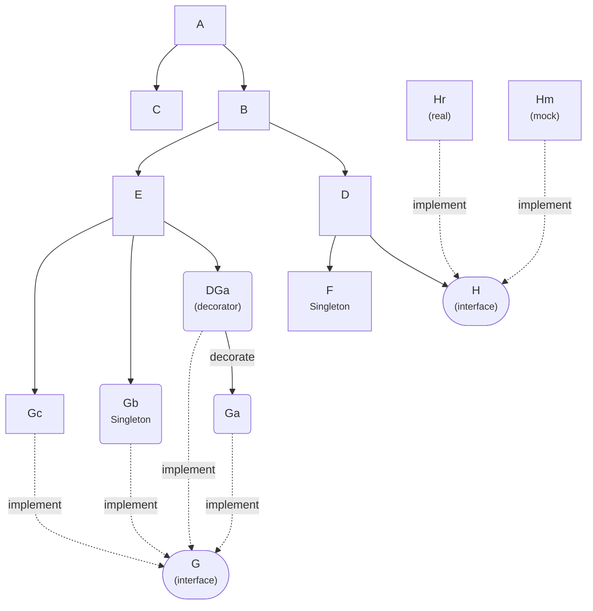

# Benchmark comparison

This sample will compare Ore (current commit of Nov 2024) to [samber/do/v2 v2.0.0-beta.7](https://github.com/samber/do).
We registered the below dependency graphs to both Ore and SamberDo, then ask them to create the concrete `A`.

We will only benchmark the creation, not the registration. Because registration usually happens only once on application startup =>
 not very interesting to benchmark.

## Data Model

- This data model has only 2 singletons `F` and `Gb` => they will be created only once
- Other concretes are `Transient` => they will be created each time the container create a new `A` concrete.
- We don't test the "Scoped" lifetime in this excercise because SamberDo doesn't have equivalent support for it. [The "Scoped" functionality of SamberDo](https://do.samber.dev/docs/container/scope) means "Sub Module" rather than a lifetime.



## Run the benchmark by yourself

```sh
 go test -benchmem -bench .
 ```

## Sample results

On my machine, Ore always perform faster and use less memory than Samber/Do:

```text
goos: linux
goarch: amd64
pkg: examples/benchperf
cpu: 13th Gen Intel(R) Core(TM) i7-1365U
Benchmark_Ore-12                          409480              2509 ns/op            2089 B/op         57 allocs/op
Benchmark_OreNoValidation-12              671000              1699 ns/op            1080 B/op         30 allocs/op
Benchmark_SamberDo-12                     218361              4825 ns/op            2184 B/op         70 allocs/op
PASS
ok      examples/benchperf      4.222s
```

As any benchmarks, please take these number "relatively" as a general idea:

- These numbers are probably outdated at the moment you are reading them
- You will get a very different numbers when running them on your machine or on production machine.
